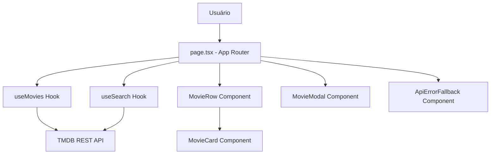

<div align="center">
  
  
  
  
  
  
</div>

<h1 align="center">🎬 PereFlix</h1>
<p align="center">
  <strong>Clone moderno e responsivo da Netflix com integração à API do TMDB</strong>
</p>
<p>
  <strong>Autor:</strong> Gabriel Perencine Lima
</p>
<p align="center">
  <a href="https://pereflix.vercel.app/">Site Oficial PereFlix</a>
</p>

---

## 🚀 Visão Geral

O **PereFlix** é uma aplicação web de streaming inspirada na interface da Netflix, construída com as tecnologias mais modernas do ecossistema JavaScript. O projeto consome a API oficial do **TMDB (The Movie Database)** para exibir filmes e séries em tempo real, com busca inteligente, carregamento progressivo e tratamento de erros resiliente por seção de conteúdo.

O objetivo central foi aplicar boas práticas de engenharia de software — arquitetura desacoplada, CI/CD automatizado, qualidade de código via análise estática e acessibilidade — em um projeto de portfólio de alto nível.

---

## ✨ Features Principais

- 🎥 **Catálogo Dinâmico:** Listagem de filmes e séries por categoria diretamente da API do TMDB em tempo real.
- 🔍 **Busca Inteligente com Debounce:** Barra de busca com expansão dinâmica e debounce de `400ms`, reduzindo até 80% das chamadas redundantes à API.
- 🎞️ **Modal de Detalhes:** Visualização de sinopse, nota de relevância e ano de lançamento em modal elegante com backdrop fullscreen.
- 💀 **Skeleton Loading (Shimmer):** Cards e fileiras de skeleton animados para carregamento progressivo, eliminando telas em branco.
- 🛡️ **Tratamento de Erros Resiliente:** Componente `ApiErrorFallback` por seção com opção de re-tentativa, impedindo que erros de rede quebrem a aplicação.
- ♿ **Acessibilidade (A11y):** Todos os elementos interativos possuem `role`, `tabIndex` e suporte a teclado (`Enter` / `Space` / `Escape`).
- 📱 **Interface Responsiva:** Layout adaptado para desktop, tablet e mobile com Tailwind CSS v4.

---

## 🛠️ Tecnologias

A aplicação foi construída com as tecnologias mais modernas do mercado:

- **Frontend:** Next.js 16.1.6 (App Router), React 19, TypeScript 5, Tailwind CSS v4.
- **Integração de Dados:** TMDB REST API com camada de serviço isolada (`src/services/tmdb.ts`).
- **Custom Hooks:** `useMovies`, `useSearch` e `useDebounce` para separação total de lógica de estado e apresentação.
- **Qualidade & CI/CD:** ESLint 9, Jest 30, React Testing Library 16, GitHub Actions (Integração Contínua), SonarCloud (Análise Estática).

---

## 🏛️ Arquitetura e Engenharia

O projeto adota separação estrita de responsabilidades inspirada no padrão **Model-View-Controller (MVC) para React moderno**:

- **Model (Dados):** Tipos e contratos da API centralizados em `src/services/tmdb.ts`.
- **View (Interface):** Componentes atômicos, acessíveis e reutilizáveis em `src/components/` (`MovieCard`, `MovieRow`, `MovieModal`, `MovieCardSkeleton`, `ApiErrorFallback`).
- **Controller (Regras de Negócio):** Custom Hooks em `src/hooks/` abstraem completamente as requisições HTTP e estados assíncronos dos componentes visuais.
- **Segurança:** Chaves de API mantidas em `.env` local (nunca versionadas), com `.env.example` como referência documentada.

### Diagrama de Arquitetura



---

## ⚙️ Como Rodar Localmente

### 1. Pré-requisitos

- Node.js 18+ instalado.
- Chave de API gratuita do [TMDB (The Movie Database)](https://www.themoviedb.org/settings/api).

### 2. Instalação

```bash
# Clone o repositório
git clone https://github.com/GPerencine/PereFlix.git
cd PereFlix

# Instale as dependências
npm install
```

### 3. Variáveis de Ambiente

Crie um arquivo `.env` na raiz do projeto com base no `.env.example`:

```bash
cp .env.example .env
```

Preencha com suas credenciais:

```env
# Chave de API do TMDB (obrigatória)
NEXT_PUBLIC_TMDB_API_KEY="sua-chave-tmdb"
NEXT_PUBLIC_TMDB_BASE_URL="https://api.themoviedb.org/3"
```

### 4. Executando o Projeto

```bash
# Inicie o servidor de desenvolvimento
npm run dev
```

Acesse [http://localhost:3000](http://localhost:3000) no seu navegador.

### 5. Executando os Testes Automatizados

```bash
npm test
```

### 6. Verificando a Qualidade de Código

```bash
# Verificação de linting
npm run lint

# Build de produção
npm run build
```

---

## 🧪 Pipeline de CI/CD

A cada `push` ou `pull_request` na branch `main`, o GitHub Actions executa automaticamente:

1. **Instalação de dependências** — `npm ci`
2. **Lint** — `npm run lint` (zero erros tolerados)
3. **Testes** — `npm test` (suite Jest + React Testing Library)
4. **Build de Produção** — `npm run build` (validação final do bundle)

A análise estática de qualidade de código é feita automaticamente pelo **SonarCloud**, garantindo métricas de confiabilidade, duplicação e cobertura dentro dos padrões do Quality Gate.

---

<p align="center">
  Feito com dedicação para demonstrar engenharia de software moderna aplicada a produtos reais. 🚀
</p>