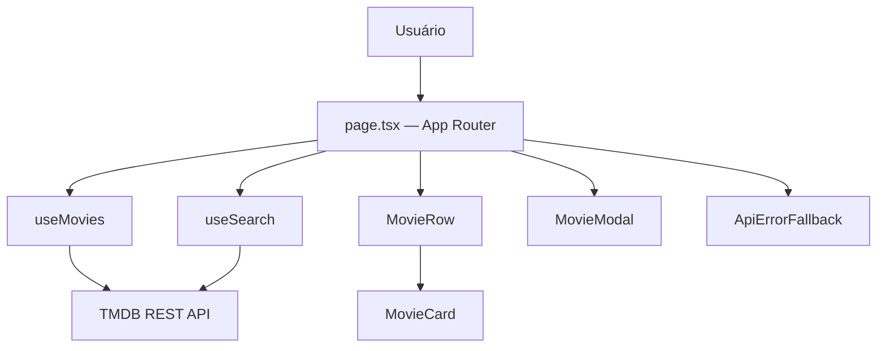

<div align="center">

# 🎬 PereFlix

<p>
  
  
  
  
  
  
</p>

**Clone moderno da Netflix com catálogo em tempo real via TMDB API, busca com debounce e skeleton loading.**

[🌐 Acessar aplicação](https://pereflix.vercel.app/)

</div>

---
<div align="center">
  Desenvolvido por <strong>Gabriel Perencine Lima</strong>
</div>

## Sobre

PereFlix é uma aplicação de streaming inspirada na interface da Netflix, construída para demonstrar boas práticas de engenharia de software em um produto visual de alta fidelidade. O projeto consome a **TMDB API** para exibir filmes e séries em tempo real, com busca inteligente, carregamento progressivo e tratamento resiliente de erros por seção.

A arquitetura segue separação estrita de responsabilidades: custom hooks isolam toda a lógica de estado e requisições HTTP, enquanto os componentes são puramente visuais e reutilizáveis.

---

## Funcionalidades

| Feature | Descrição |
|---|---|
| 🎥 Catálogo Dinâmico | Filmes e séries por categoria, consumidos em tempo real da TMDB API |
| 🔍 Busca com Debounce | Expansão dinâmica com debounce de 400ms — reduz ~80% das chamadas à API |
| 🎞️ Modal de Detalhes | Sinopse, nota e ano de lançamento com backdrop fullscreen |
| 💀 Skeleton Loading | Cards e fileiras animados — sem telas em branco durante o carregamento |
| 🛡️ Error Boundary por Seção | `ApiErrorFallback` com retry — erros de rede não quebram o restante da página |
| ♿ Acessibilidade | `role`, `tabIndex` e navegação por teclado (`Enter` / `Space` / `Escape`) |
| 📱 Responsivo | Layout adaptado para desktop, tablet e mobile |

---

## Stack

| Camada | Tecnologia |
|---|---|
| **Framework** | Next.js (App Router), React 19, TypeScript 5 |
| **Estilo** | Tailwind CSS v4 |
| **Dados** | TMDB REST API — camada isolada em `src/services/tmdb.ts` |
| **State / Lógica** | Custom Hooks: `useMovies`, `useSearch`, `useDebounce` |
| **Testes** | Jest, React Testing Library |
| **Qualidade / Deploy** | ESLint 9, SonarCloud, GitHub Actions, Vercel |

---

## Arquitetura



---

## Configuração Local

**Pré-requisito:** Node.js 18+ e chave gratuita do [TMDB](https://www.themoviedb.org/settings/api).

```bash
git clone https://github.com/GPerencine/PereFlix.git
cd PereFlix
npm install
cp .env.example .env
```

Preencha `.env`:

```env
NEXT_PUBLIC_TMDB_API_KEY=sua-chave-tmdb
NEXT_PUBLIC_TMDB_BASE_URL=https://api.themoviedb.org/3
```

```bash
npm run dev     # http://localhost:3000
npm test        # Suíte de testes
npm run build   # Validação do bundle de produção
```

---

## CI/CD

A cada push ou PR na `main`, o GitHub Actions executa:

1. `npm ci` — instalação determinística
2. `npm run lint` — zero erros tolerados
3. `npm test -- --coverage --ci` — cobertura mínima de 70%
4. `npm run build` — validação do bundle de produção

O SonarCloud realiza análise estática com Quality Gate integrado. O deploy para produção na Vercel ocorre automaticamente após o merge na `main`.